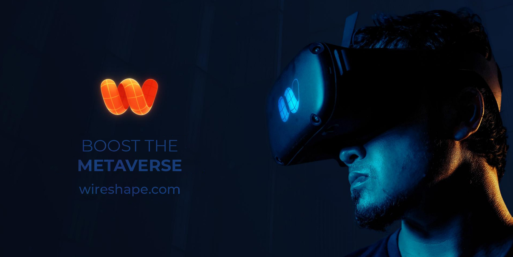

# Overview



## What is Wireshape?

Wireshape is an ecosystem that turns photos into high-resolution 3D objects and provides this 3D scanned data for metaverse, VFX and game produces, so that reality is ready to be used in virtual worlds, eliminating the complexity, slowness and high cost of creating 3D models. Wireshape reached a highly scalable result in 3D scanning technology, making it possible to generate 3D models just like the real object and ready to use in instants instead of months.&#x20;

> We are committed to making the metaverse an accessible and decentralized environment.

Wireshape 3D scanned assets stock brings together contributors from across the globe, who receive token rewards and have their co-authorship guaranteed by NFTs.&#x20;


This global reach has only been possible due to the breaking down of the bureaucratic and expensive barrier of the traditional banking system when dealing with international transactions.


Filmmakers, Metaverse and Game developers will be able to compose incredibly realistic scenes with just a few clicks. &#x20;

> We believe that in the near future people will produce and consume 3D models as they produce and consume photos and videos today. We are here to deliver the tools to make this possible.

## What is $WIRE?

$WIRE is a token with true real world use purpose. The holders will be able to stake to vote on DAO governance and to earn staking rewards, attend to exclusive events, pay for Wireshape Library and 3D Scan Software Subscriptions, access the Let's education platform, pay the contributors royalties and more.

> $WIRE Token has not released yet, launching date to be announced.&#x20;

