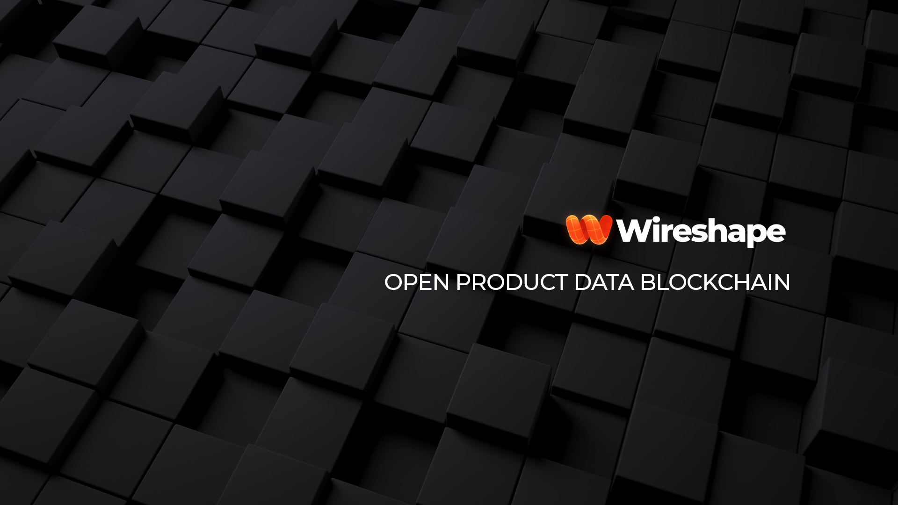
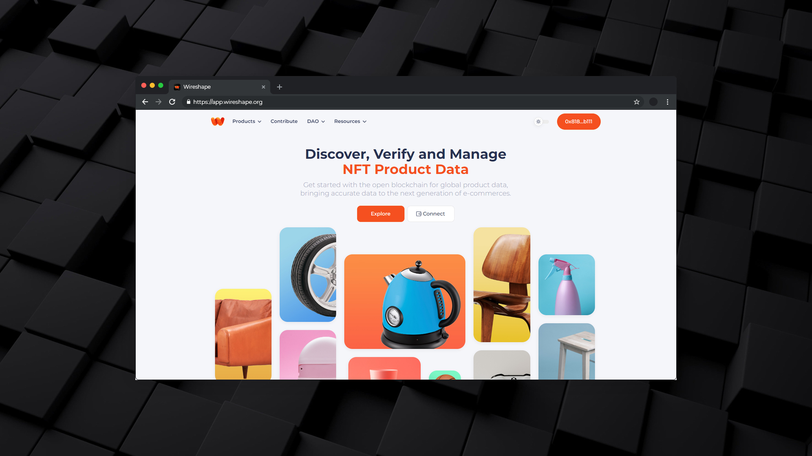

# Overview

Wireshape is an open blockchain solution that provides a decentralized, secure, and transparent way for storing and sharing product data. This eliminates the need for a central authority to manage and verify the data, and allows all stakeholders to trust the information being shared. The distributed nature of blockchain also ensures that the data is tamper-proof and cannot be altered without the consensus of the network participants.

## Current market challenges

One of the biggest challenges in supply chain management today is the lack of standardization in product information distribution. This can lead to confusion and misunderstandings between manufacturers, distributors, sellers and consumers, generating a high rate of complaints and returns, especially in online purchases, where it is difficult for consumers to find the information they need to make informed purchasing decisions.

## Open blockchain

<figure><figcaption></figcaption></figure>

Wireshape open blockchain technology has the potential to revolutionize the way that product data is managed and shared globally. With the increasing trend towards ecommerce, it has become increasingly important for product information to be easily accessible and standardized.

By implementing Wireshape blockchain-based product information standard, all stakeholders in the product lifecycle, from manufacturers to consumers, can access and share accurate, up-to-date information in real-time.

## Token Curated Product Registry (TCPR)

<figure><figcaption></figcaption></figure>

In Wireshape blockchain the engine of decentralization of product data is in charge of the Token Curated Product Registry (TCPR), a decentralized system of curation of product information, which creates a reliable database recorded on the blockchain and maintained by the community, which receives intrinsic incentives in WWIRE tokens as rewards.

## Reviews 

Decentralized reviews are an important aspect of Web3 technology in e-commerce, as they provide a more secure and transparent way for customers to rate and review products. Decentralized reviews eliminate the need for intermediaries, such as centralized platforms, and provide customers with more control over the information they share and access. This allows customers to make informed decisions about the products they purchase, while also providing merchants with more accurate feedback about their products.

## AR NFTs 

AR NFTs, or Augmented Reality Non-Fungible Tokens, are another innovative application of Web3 technology in e-commerce. AR NFTs are digital assets that are stored on the blockchain and can be used to create unique and interactive shopping experiences for customers. For example, AR NFTs can be used to provide customers with virtual try-on experiences for clothing, or to create interactive product demonstrations. This can help to increase customer engagement and to create a more immersive and memorable shopping experience.

## API

<figure><figcaption></figcaption></figure>

Innovative platforms and e-commerces can quickly populate their systems with complete product data by integrating the API provided by Wireshape with blockchain data, making it easier and more cost-effective to launch.

By providing increased security, transparency and efficiency, Wireshape hopes to encourage decentralization and innovation in the consumer goods space which leads to a better and more equitable experience for all stakeholders.
