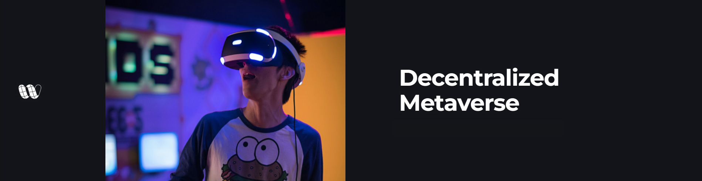

# Why, What and When?

## Why Wireshape?

Wireshape ecosystem has been developed to help the 3D computer graphics industry achieve fast and accurate results. This new approach will allow the popularization of the use of AAA 3D models. With our solution, metaverse, game and visual effects productions will be able to save time and money while raising the level of realism of their content.

The traditional creation of 3D models requires a slow and complex pipeline, which starts with research and conceptual design, goes through 3D modeling and then texturing, where colors and details are added. We aim to free artists so they can finally dedicate themselves to creative work, to create the unimagined instead of spending days trying to reproduce the real world.


Wireshape founders have been in the 3D computer graphics industry for more than 10 years, so we are oriented by the professional and productions needs.


With an accurate photogrammetry technique, the Wireshape cloud platform automatically generates 3D objects from photos, that will be made available to computer graphic projects, allowing brilliant photographers around the globe to use their creativity and skill to explore the world in details and receive NFTs and recurring payouts in $WIRE by becoming contributors.

.jpg>)

## What makes Wireshape unique?

There are a few key reasons that make Wireshape different.

1. Wireshape is focused on delivering exclusively ready to use 3D scanned models, with quality and delivery standards compatible with the main tools on the market.
2. We work with contributing photographers from around the world, who upload their photos through our platform to generate the 3D models automatically in the cloud.
3. Our cloud software is capable of auto generating high definition 3D models from photos.
4. We utilize decentralized finance to ensure our global reach with reduced cost of international financial transactions and greater accessibility.
5. NFTs and Token with true real world use purpose.
6. Contributors will receive special NFTs that guarantee their royalties. Wireshape distributes its revenue from subscriptions to the 3D Scanned Assets Stock in $WIRE to contributors and owners of these special NFTs.
7. We are creating opportunities to encourage the emergence of new projects that drive the metaverse and web3. Such as creating a launchpad / investment fund for such projects.
8. The founding team has a combined 30 years of experience in the 3D industry. We feel in the skin the pain of this market and we know our customer.

## At the Time and Place

We are in a revolutionary period of transition from web2 to web3. The metaverse market is booming owing to increasing demand from end-use industries, which prominently include media and entertainment, education and aerospace. The growing demand for metaverse to purchase digital assets using cryptocurrencies is expected to drive the market significantly. The development and distribution of Augmented reality (AR), Virtual Reality (VR), and Mixed Reality (MR) devices are anticipated to spur market growth in years to come.

The metaverse is the advent of new online environments in which people's interactions are more multidimensional and they can engage more deeply with digital content rather than merely reading it. On Metaverse platforms that allow blockchain technology to be utilized, users can create, own, and trade autonomous digital assets and virtual regions using cryptocurrencies, as well as nonfungible tokens (NFTs).

Rising demand for blockchain-based metaverse networks and platforms for trading digital assets is expected to drive considerable market revenue growth. One of the major factors driving the future expansion of the metaverse business is the rise of the gaming industry.

See more about the global metaverse market size report on ResearchAndMarkets.com.

