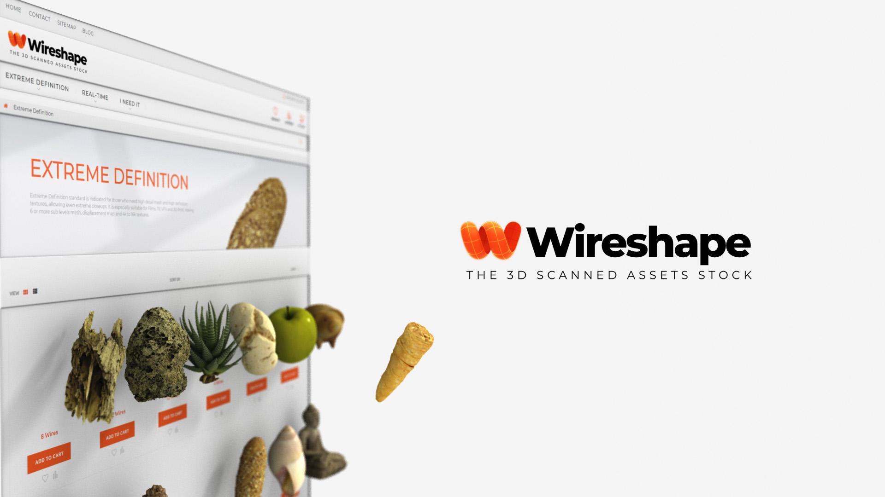
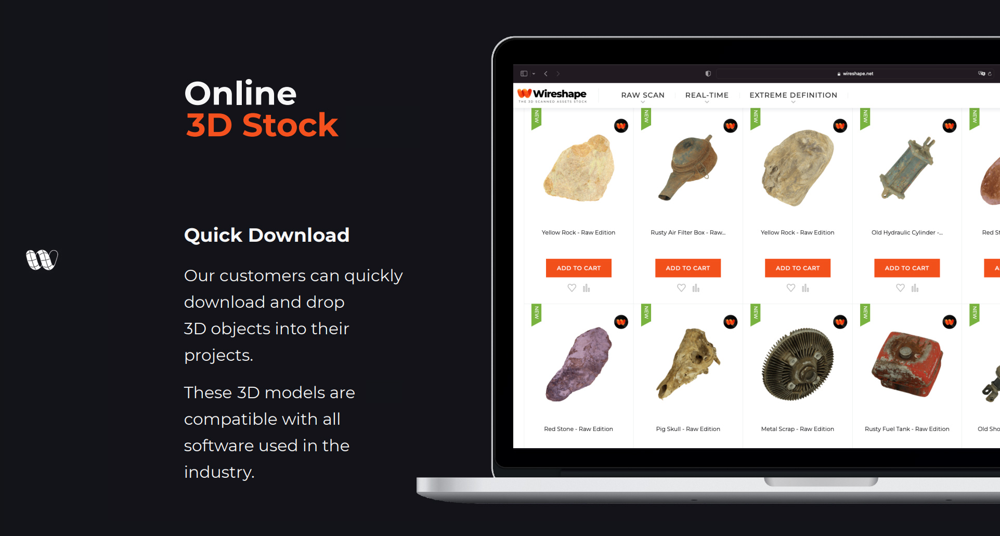

# 3D Scanned Assets Library

On Wireshape 3D Scanned Assets Library our customers can quickly download and drop 3D objects into their projects. So that everyone will be able to create new worlds in AAA quality and realism.

We have affordable subscription plans for every client size, whether a freelancer, indie, studio or enterprise. This subscription will have incentives when paid in $WIRE token. There will also be an option to pay in $USD for customers not yet adapted to WEB3. And so we will make sure that this value will be converted to $WIRE for the subscription pool, which will be distributed to the contributors.

### Wireshape 3D Scanned Assets Features

#### TOPOLOGY Quad Based

All 3D scanned models are exposed to postcapture process, resulting in assets with cleaned mesh, quad topology and real scale.

#### DIMENSIONS Accuracy

Detailed capture and processing for faithfulness of shapes, textures and reliefs to the real surface.

#### RESOLUTION 6+ SubD Levels

Following emerging technologies, we will deliver meshes with multilevel subdivision polygons.

#### TEXTURES 4k to 16k

Accurate maps in high definition, with perfect seams and color depth to ensure high-end quality and the level of details.

#### COLORS Checked Calibration

3D scanner is all about faithfulness, ideal for productions that need to to keep the CGI with a high level of credibility.

#### COMPATIBLILITY Standard Formats

The 3D scanned models are compatible with all softwares used in the advertising and entertainment industry. Ready to be used in metaverse, games and visual effects projects.

### Watch Some 3D Scanned Models Preview







Watch more here:


