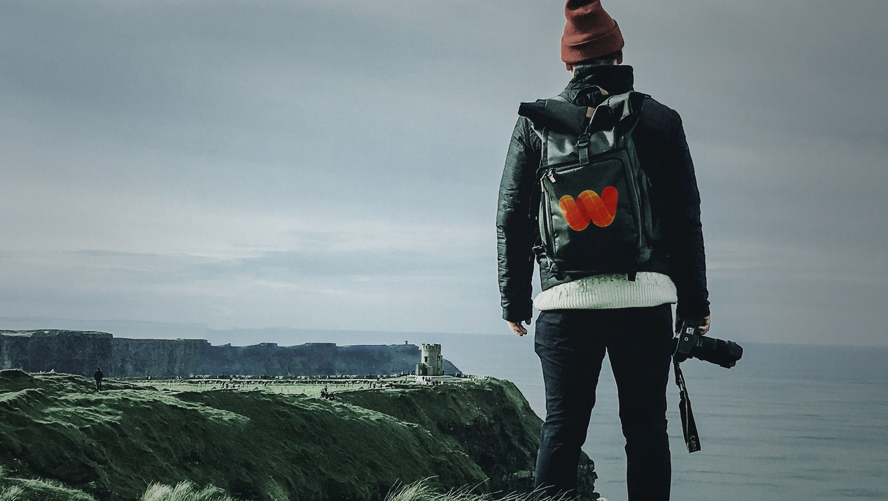

# Let's Platform

Let's is the platform for education and training of photographers and drone pilots who want to  enter the fabulous world of photogrammetry, to turn contributors and have their shots transformed into Wireshape 3D models, which will be used in major game, metaverse and film productions.

Wireshape will bring a curatorship of exclusive tutorials, tips and ideas for detailed and wonderful captures, capable of transposing the subtleties of reality to the virtual world.

**See more:**



