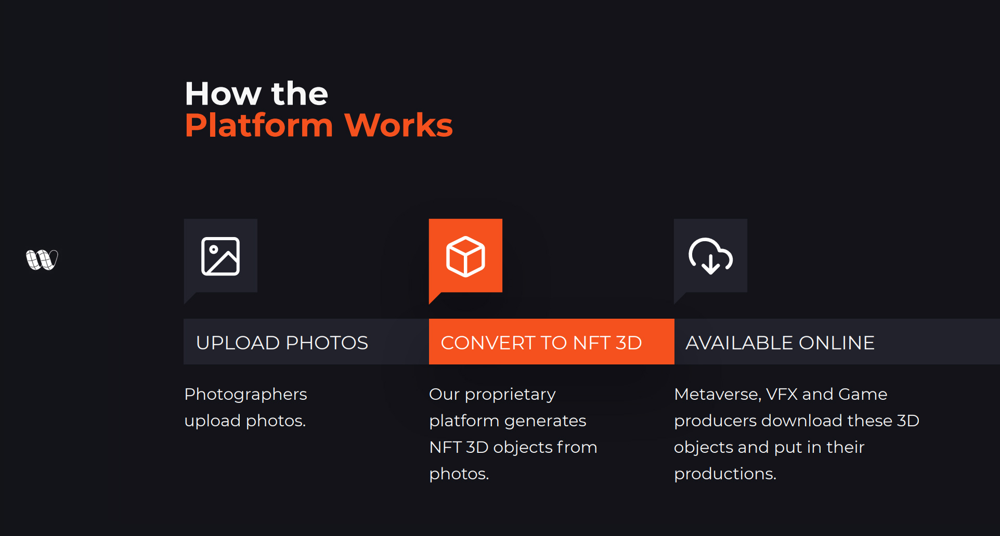

# Traditional Method Problems

The traditional creation of 3D models requires a complex pipeline, which starts with research and conceptual design, goes through 3D modeling and then texturing, where colors and details are added.

### Specialized Workforce

Need for highly specialized professionals to create Metaverse, AR, VR, VFX and Game content.

### Slow and Expensive

Creation process with hundreds of artists and dedicated software licenses in a back-and-forth workflow.

### Lack of Reality

Lack of realistic 3D objects on the industry and creative professionals doing non-creative jobs.

### Not Web3 Compatible

Traditional trading method not compatible with metaverse, NFT blockchain and crypto.

