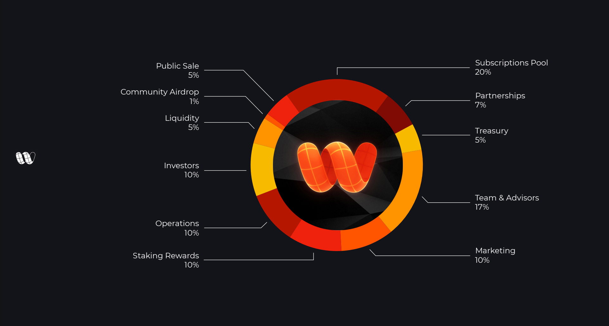

# Tokenomics

## WIRE Specifications

**Max Supply:** 1B\
**Token Symbol:** $WIRE\
**Chain:** Polygon\
**LP | DEX:** WIRE/USDC | SushiSwap\
**Farms / Rewards:** 100M WIRE during 730 days from TGE

> $WIRE Token has not released yet, launching date to be announced.

## Token Allocation

* Subscription Pool - 20%
* Team & Advisors - 17%
* Investors - 10%
* Rewards - 10%
* Operations - 10%
* Marketing - 10%
* Partnerships - 7%
* Treasury - 5%
* Liquidity - 5%
* Public Sale - 5%
* Community Airdrop - 1%
